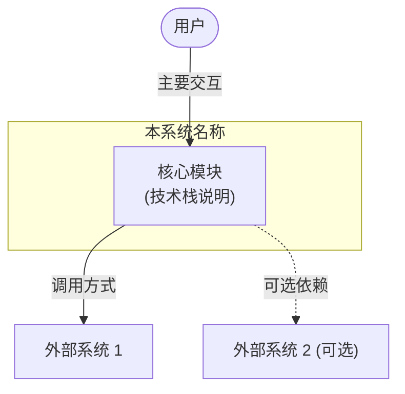

# arch-doc: Codebase Architecture Documentation

Analyze a feature domain across all layers—data, service, client, runtime—and produce a structured, diagram-rich architecture document ready for human annotation and iterative refinement.

Documents are written for two audiences: a new team member reading top-to-bottom, and an experienced developer scanning for a specific layer. Structure and visual density serve both.

## Invocation

```
arch-doc <topic>
```

`<topic>` is the feature domain to analyze (e.g. `skill-agent`, `auth`, `chat-runtime`, `file-storage`). Derive the output path as `tasks/<topic>/research.md`. Create the directory if it doesn't exist.

If `<topic>` is ambiguous or very broad, use `AskUserQuestion` to narrow scope before starting research.

---

## Phase 0: Scope Assessment

Before launching subagents, spend two minutes forming a mental map of the domain.

1. Run `git log --oneline -20` to understand recent activity.
2. Grep for `<topic>` across the codebase to identify anchor files.
3. List the 5-8 most central files. These become the explicit targets for each subagent.

State in one line: the domain boundary, the estimated number of DB tables involved, and which layers are most complex.

---

## Phase 1: Parallel Research (4 Subagents)

Launch all four subagents simultaneously. Each is scoped to one architectural layer. Pass the anchor file list from Phase 0 as starting points.

**Subagent A — Data Layer**

Research target files:
- `packages/database/src/schemas/<topic>*.ts` — table definitions, column types, constraints, indexes
- `packages/database/src/models/<topic>*.ts` — CRUD methods, query patterns
- `packages/database/src/repositories/<topic>/` — complex repository operations

Report: table names, key fields (especially FKs and jsonb), unique constraints, indexes, and model method signatures. Note any junction tables and their enable/disable patterns.

**Subagent B — Server Layer**

Research target files:
- `src/server/services/<topic>/` — business logic, orchestration, deduplication
- `src/server/routers/lambda/<topic>*.ts` — TRPC endpoints (auth vs public)
- `src/server/routers/lambda/market/<topic>.ts` — if market-facing

Report: service class names, public method signatures with params/returns, TRPC procedure names, auth requirements, and which services call which.

**Subagent C — Client Layer**

Research target files:
- `src/store/<topic>/` — Zustand slices, actions, selectors, state shape
- `src/services/<topic>*.ts` — client-side service wrappers
- `src/features/` and `src/routes/` — UI components that own the domain

Report: store slice names, key state fields, key actions, how components read/write state, and client service method names.

**Subagent D — Runtime & Interaction Layer**

Research target files:
- `src/services/chat/mecha/` — context engineering, skill engine
- `src/server/modules/Mecha/` — server-side tools engine
- `src/store/chat/` — agent execution, tool call routing
- `src/store/tool/slices/builtin/executors/` — executor registry

Report: the end-to-end flow when a user action triggers domain logic. Trace: trigger → store action → client service → TRPC → server service → DB. For runtime flows: message send → tool resolution → executor → result. Include function signatures at each boundary.

---

## Phase 2: Synthesize & Write

Merge the four research outputs into a single document. Write directly to `tasks/<topic>/research.md`.

### Document Structure

Follow this exact section order:

```
# <Topic> 架构全景文档

> 日期：YYYY-MM-DD | 状态：v1 待批注

---

## 一、架构总览

### 1.1 系统边界（C4 L1）
### 1.2 核心架构决策
### 1.3 系统分层（C4 L2）
### 1.4 <数据流向或两层结构>
### 1.5 核心生命周期

---

## 二、<主要流程 A>（入库 / CRUD / 导入）

### 2.1 <流程总图>
### 2.2 <细节时序>
### 2.3 <关键策略（去重 / 合并 / 缓存）>

---

## 三、<主要流程 B>（Agent / 市场 / 运行时）

---

## 四、<核心交互机制>

### 4.1 绑定模型
### 4.2 操作时序
### 4.3 运行时加载（如有）

---

## 五、设计模式

---

## 六、数据模型参考（后置）

---

## 七、关键文件索引
```

Adapt section names to fit the domain. If a section doesn't apply, omit it rather than leaving it empty.

---

## Diagram Selection Rules

**Use Mermaid when:**
- Showing system topology with multiple nodes and directional relationships (graph TB / flowchart)
- Showing time-ordered interactions between more than 2 parties (sequenceDiagram)
- Showing flow with decision branches (flowchart with decision nodes)

**Use tables when:**
- Listing fields, methods, or options with 2-3 attributes each
- Showing a simple mapping (type → source → example)
- CRUD endpoint lists

**Use ASCII / indented text when:**
- Showing a tree or hierarchy (store slices, group membership, config merge chain)
- Showing a simple linear flow (A → B → C with annotations)

**Diagram constraints:**
- Each Mermaid block: ≤ 300 tokens
- One diagram per logical component or interaction boundary
- Never put all system knowledge into a single diagram

---

## C4 L1 Template

The system boundary diagram goes in section 1.1. Show: this system, end users, and external systems it calls or is called by. Use `graph TB`.



Mark optional/external-only dependencies with dashed arrows (`-.->`) and a note.

---

## Writing Rules

**Lead with the diagram, follow with the explanation.** Never write three paragraphs before showing a diagram.

**Mixed Chinese/English:** use Chinese for section headings, prose, and table labels. Use English for code identifiers, file paths, method names, and technical terms.

**Be precise about what is local vs. external.** If a service has been migrated from an external dependency to a local DB, say so explicitly with a before/after comparison.

**Note design decisions, not just facts.** When something is done in an unusual way (e.g., using `jsonb string[]` instead of a junction table), explain why or mark it as a decision worth noting.

**Avoid:**
- Listing every method of a class — only the ones that matter for understanding the architecture
- Repeating information that is already visible in a diagram
- Generic descriptions like "handles CRUD operations" — say which operations and what they return

---

## Phase 3: Self-Review Checklist

Before writing the final file, verify:

- [ ] C4 L1 shows all external dependencies (including optional ones with dashed arrows)
- [ ] Each major flow has at least one diagram
- [ ] Runtime/interaction flows are covered (not just static data model)
- [ ] No section is empty or placeholder
- [ ] Design decisions are explicitly called out, not buried in prose
- [ ] File index in the last section covers all files researched
- [ ] Document version is `v1 待批注`

---

## Output

Write the completed document to `tasks/<topic>/research.md`.

End with a one-line summary in chat: document path, section count, and the 2-3 most architecturally significant findings from the research.

Do not paste the full document into chat. The file is the output.
